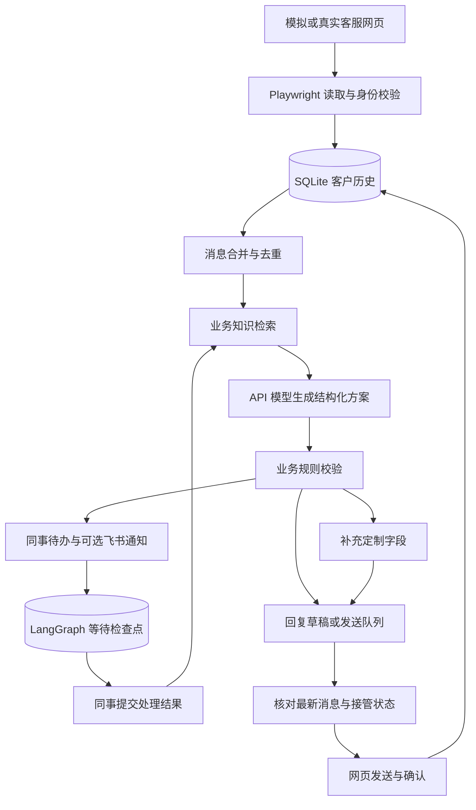

# 本地客服应用架构

## 运行边界

一台设备运行一个本机 HTTP 服务、一个持久浏览器上下文和最多两个模型工作线程。前端采用静态 HTML/CSS/JavaScript，不需要 Node、容器、Redis 或独立 OpenClaw 服务。LangGraph 是受控业务流程编排器；模型没有任意执行代码或操作电脑的权限。

只有浏览器线程读写网页；不同客户的模型请求可以并行，同一客户同一时刻只允许一个任务。进程停止时取消尚未开始的请求、等待进行中的请求完成并关闭浏览器。

## 数据归属

默认数据目录 `artifacts/app/`，支持启动参数 `--data-dir`：

| 数据 | 内容 |
| --- | --- |
| `business.sqlite3` | 店铺与客户、原始文字消息、已确认需求、模型配置、知识条目、发送队列、同事待办、运行事件 |
| `checkpoints.sqlite3` | 按会话 ID 保存 LangGraph 节点状态与等待中断 |
| `browser/` | 按网页来源和店铺隔离的浏览器登录与配置目录 |
| `mock.json` | 独立模拟网页数据；业务运行器不通过此文件读取消息 |

会话主键来自“网页来源 + 店铺标识 + 客户标识”；消息按会话与平台消息 ID 去重。真实网页没有暴露客户唯一 ID 时暂用昵称，遇到同名跳过，此限制需要在实际接入时消除。

原始消息保留，模型每次只收到有界历史、已收集字段、检索片段和同事处理结果。业务数据库不是检查点缓存，升级流程实现时不能直接删除客户历史。

## 流程状态

LangGraph 节点为 `retrieve → plan → validate → record_reply/create_task`。`create_task` 写入幂等待办并进入 `wait_colleague` 中断；提交结果后使用 `Command(resume=...)` 恢复，重新检索并组织回复。

- 普通咨询：检索依据有效且模型给出相关知识 ID，才生成业务回复。
- 定制：合并客户明确提供的字段，按配置追问缺失字段，完整后生成待办。
- 特殊报价、复杂售后、依据不足：生成待办并等待同事。
- 无关问题：固定业务引导；最近已引导过则忽略重复请求。
- 常见结束语：无需重复答复。

知识 ID 校验不能证明回复中的每句话都被资料支持。回复方式与页面来源独立，默认填写草稿：由浏览器线程填入网页但不发送；自动发送则进入发送队列。没有实时库存、订单或价格查询组件时，不把历史 CSV 视为实时系统。

会话可由同事接管。模型返回时再次检查会话最新消息和接管状态，过期结果不能恢复自动接待或覆盖新消息。等待期间仍同步新消息，同事结果恢复时使用最新历史。

## 发送与通知

发送队列以会话和输入消息 ID 去重。自动发送或管理页点击“发送回复”进入 `ready` 状态，实际发送前重新打开目标客户、检查 DOM 最新消息、确认编辑框没有其他手写内容，并原子检查暂停/接管/取消状态。填写草稿保留 `draft` 状态，仅由浏览器线程填入；同一版本只尝试一次，可在完全停止并重新开始接待后重试。点击后只有发现新的客服消息 ID 且正文一致才记录 `sent`；允许 Chromium contenteditable 产生的连续空行差异，保留实际网页文本和消息 ID。

新输入将未发送的旧草稿标为 `stale`。无法确认发送结果时标为 `uncertain`，接管该会话并等待核对；程序崩溃时遗留的 `sending` 也在下次启动转为 `uncertain`。真实网页不能承诺严格一次发送，所以不自动重发结果不明的记录。

飞书采用显式启用的单向 Webhook。每条待办仅从 `pending` 领取通知，保存成功、失败或结果不明状态。没有设置通知成功上下文时，客服不会声称已完成转交。员工处理结果先由本机页面填写，飞书回调、待办分配、失败通知重试界面尚未实现。

## 接入扩展

`BrowserAdapter` 集中保存当前 DOM 选择器，向运行器提供列出客户、打开客户读取文字、发送与确认、关闭四类操作。真实平台验证后可拆成独立适配类，业务图无需跟随页面结构修改。

`ModelClient` 提供 OpenAI Chat Completions 与 Anthropic Messages 两种协议，统一提取最终文本并解析业务 JSON。协议错误、HTTP 认证失败、限流和超时转为脱敏错误，运行器按客户退避重试；请求失败不生成可发送回复。

下一阶段重点是实际京东页面的稳定客户 ID、历史分页、接待/未读语义、图片资料、订单工具、飞书协作回调以及多客户高并发与长时间运行压力验证。当前浏览器冒烟测试证明模拟文字链路可用，不代表这些能力已完成。
